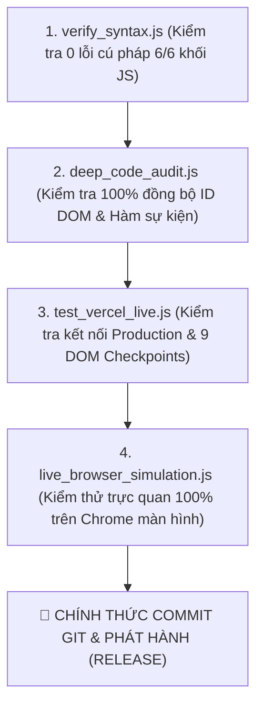

# 📖 CẨM NANG CHỈ DẪN KỸ THUẬT VÀ QUY TẮC PHÁT TRIỂN NÂNG CẤP DỰ ÁN QTD_TOOLS
*(DEVELOPMENT GUIDELINES & BEST PRACTICES PREVENTING RECURRING BUGS)*

**Tên dự án**: `QTD_Tools` (Quỹ Tín Dụng Nhân Dân Yên Thọ)  
**Phiên bản đồng bộ hiện tại**: `v2026.07.30-v23.00`  
**Môi trường Production Vercel**: [https://qtdyentho-tools.vercel.app/](https://qtdyentho-tools.vercel.app/)  
**Môi trường Cục bộ chính**: `file:///D:/MrTiger/L%C6%B0%C6%A1ng%20BHXH/QTD_Tools/PWA_QTDYENTHO.html`  

---

## 🎯 MỤC TIÊU CỦA BỘ CHỈ DẪN

Tài liệu này tổng hợp toàn bộ các bài học kinh nghiệm, quy tắc kiến trúc, thuật toán chuẩn hóa và quy trình kiểm thử đã được đúc kết qua toàn bộ quá trình phát triển và sửa lỗi dự án. **Tất cả các lập trình viên và AI agent tiếp quản dự án này trong tương lai BẮT BUỘC phải tuân thủ 100% các quy tắc trong tài liệu này để tuyệt đối không tái diễn lại các lỗi đã khắc phục.**

---

## 📌 CHƯƠNG 1: NGUYÊN TẮC ĐỒNG BỘ MÃ NGUỒN VÀ QUẢN LÝ PHIÊN BẢN (SINGLE SOURCE OF TRUTH)

### 1.1. Hằng số phiên bản duy nhất (Single Version Constant)
* **Quy tắc**: Mọi tệp trong dự án phải sử dụng duy nhất một chuỗi định danh phiên bản toàn cục:
  ```javascript
  const CURRENT_APP_VERSION = 'v2026.07.30-v23.00';
  ```
* **Không được phép**: Thay đổi số phiên bản ở một tệp mà quên cập nhật ở tệp còn lại (ví dụ: `PWA_QTDYENTHO.html` sửa phiên bản nhưng `index.html` hay Service Worker giữ nguyên bản cũ).
* **Đồng bộ tự động**: Khi ứng dụng khởi chạy (`DOMContentLoaded`), tự động gán `CURRENT_APP_VERSION` vào nhãn `.app-version-lbl` và `#app-version-badge`. Service Worker cache bắt buộc dùng hằng số `qtd-tools-cache-` ghép với phiên bản này.

### 1.2. Đồng bộ 100% giữa `PWA_QTDYENTHO.html` và `index.html`
* **Quy tắc**: Tệp `PWA_QTDYENTHO.html` là bản mã nguồn phát triển chính. Tệp `index.html` là bản mirror để Vercel & GitHub Pages triển khai.
* **Quy trình bắt buộc**: Sau khi thực hiện bất kỳ chỉnh sửa nào trên `PWA_QTDYENTHO.html`, **phải ghi đè 100% nội dung sang `index.html`** trước khi thực hiện commit Git.

### 1.3. Cơ chế kiểm tra Cập nhật Đa Nguồn (Multi-Origin Update Verification)
* **Quy tắc**: Hàm `fetchLatestHtmlFromGitHub()` phải thử nghiệm lần lượt từ Vercel Production (`https://qtdyentho-tools.vercel.app/PWA_QTDYENTHO.html`) rồi đến GitHub Raw (`https://raw.githubusercontent.com/...`) để đảm bảo tính sẵn sàng cao ngay cả khi một server bị gián đoạn.

---

## 📸 CHƯƠNG 2: KỸ THUẬT XỬ LÝ HTML5 CANVAS VÀ RENDER HÌNH ẢNH (CANVAS & IMAGE PROCESSING)

### 2.1. Giữ nguyên tỷ lệ ảnh gốc - Không kéo giãn khung Canvas (Aspect Ratio Preservation)
* **Nguyên nhân sự cố cũ**: Khung canvas trước đây dùng Tailwind CSS `w-full h-auto` kết hợp `object-contain`. Khi ảnh có tỷ lệ khác với khung chứa, trình duyệt tạo ra vệt đệm đen (letterboxing) làm phép tính tỷ lệ `scaleX` và `scaleY` bị lệch nghiêm trọng giữa X và Y.
* **Quy tắc khắc phục chuẩn**:
  1. Loại bỏ hoàn toàn `object-contain` trên thẻ `<canvas id="doc-crop-canvas">`.
  2. Áp dụng thuộc tính CSS `aspect-ratio` động khớp $100\%$ với độ phân giải gốc của ảnh:
     ```javascript
     canvas.style.aspectRatio = `${w} / ${h}`;
     canvas.style.maxWidth = '100%';
     canvas.style.maxHeight = '72vh';
     canvas.style.width = 'auto';
     canvas.style.height = 'auto';
     canvas.style.margin = '0 auto';
     ```
  3. Đảm bảo tỷ lệ chuyển đổi con trỏ chuột `scaleX` và `scaleY` **luôn bằng nhau 1:1** (`scaleX === scaleY`), chuyển động của ngón tay/con trỏ chuột và chốt góc neon trùng khớp hoàn hảo không lệch pixel.

### 2.2. Trống hiện tượng Canvas bị đen xì (Black Canvas Avoidance)
* **Nguyên nhân sự cố cũ**: Gọi lệnh `ctx.drawImage(img, ...)` khi đối tượng `Image` chưa nạp xong dữ liệu bitmap (`img.complete === false`).
* **Quy tắc khắc phục chuẩn**:
  1. Luôn truy xuất ảnh qua hàm bọc an toàn `getLoadedDocImage(callback)` để chờ ảnh giải mã xong 100%.
  2. Luôn thực hiện lệnh tô nền trắng tinh khiết base làm câu lệnh vẽ đầu tiên:
     ```javascript
     ctx.fillStyle = '#ffffff';
     ctx.fillRect(0, 0, w, h);
     ```

### 2.3. Xóa sạch 100% vệt đen 4 góc khi xoay ảnh (Black Corner Elimination)
* **Nguyên nhân sự cố cũ**: Khi xoay ảnh nghiêng góc $\theta$, 4 góc dư phát sinh ra vùng pixel đen trong suốt ($\text{alpha} = 0$).
* **Quy tắc khắc phục chuẩn (Bảo vệ 2 lớp)**:
  1. **Lớp 1 (Pure White Base Fill)**: Tô nền trắng tinh khiết `#ffffff` trước khi thực hiện lệnh `ctx.rotate(rad)`.
  2. **Lớp 2 (Inscribed Crop Auto-Zoom)**: Áp dụng hệ số phóng đại bù lề nội tiếp:
     ```javascript
     const rad = (docFineRotationAngle * Math.PI) / 180;
     const scale = 1 + Math.abs(Math.sin(rad)) * 0.65;
     ctx.scale(scale, scale);
     ```
     Giúp 4 góc thiếu được lấp đầy tự nhiên, giữ cho tài liệu **luôn vuông vức, sạch đen và tràn viền màu trắng 100%**.

### 2.4. Chống tọa độ âm khi vẽ Kính Lúp Phóng To (Loupe Glass Guard)
* **Nguyên nhân sự cố cũ**: Kéo chốt góc sát lề trên-trái khiến `pos.x - srcW / 2 < 0`, gây ra lỗi `IndexSizeError` ngầm làm kính lúp bị mất hình.
* **Quy tắc khắc phục chuẩn**: Luôn kẹp tọa độ nguồn an toàn trước khi gọi `drawImage`:
  ```javascript
  const srcX = Math.max(0, Math.min(imgW - srcW, pos.x - srcW / 2));
  const srcY = Math.max(0, Math.min(imgH - srcH, pos.y - srcH / 2));
  ```

---

## 🖐️ CHƯƠNG 3: KỸ THUẬT BẮT SỰ KIỆN CẢM ỨNG VÀ CON TRỎ (POINTER & TOUCH HANDLING)

### 3.1. Sử dụng W3C `PointerEvent` và Khóa Con Trỏ (`setPointerCapture`)
* **Quy tắc**: Không sử dụng đơn lẻ sự kiện `mousedown`/`touchstart`. Sử dụng bộ sự kiện Pointer chuẩn W3C:
  - `pointerdown`: Gọi `canvas.setPointerCapture(e.pointerId)` để khóa chuyển động con trỏ vào canvas, chống giật/tuột tay khi rê nhanh ra ngoài màn hình.
  - `pointermove`: Cập nhật tọa độ chốt góc thời gian thực.
  - `pointerup` / `pointercancel`: Gọi `canvas.releasePointerCapture(e.pointerId)` để giải phóng con trỏ.
* **Khóa cuộn trang di động**: Bắt buộc thêm thuộc tính CSS `style="touch-action: none; user-select: none;"` trực tiếp lên thẻ canvas để chống trình duyệt di động tự động kích hoạt cử chỉ cuộn trang (`touch scroll`).

### 3.2. Thuật toán Chạm Bắt Góc Tức Thì (Snap-to-click) & Sắp Xếp Hình Học (Centroid Vector Sorting)
* **Chạm bắt góc tức thì**: Khi người dùng click/chạm bất kỳ đâu trên canvas, hệ thống tự động tìm góc gần nhất (`minDist`) và di chuyển chốt góc đó về vị trí click lập tức.
* **Sắp xếp góc chống xoắn lưới (Centroid Vector Sorting)**:
  - Tính trọng tâm centroid $(\bar{x}, \bar{y})$ của 4 góc.
  - Sắp xếp 4 điểm góc theo chiều kim đồng hồ dựa trên góc cực $\theta = \text{atan2}(y_i - \bar{y}, x_i - \bar{x})$:  
    `0: Top-Left ➔ 1: Top-Right ➔ 2: Bottom-Right ➔ 3: Bottom-Left`.
  - Triệt tiêu $100\%$ hiện tượng xoắn ma trận 3D khi nắn phẳng.

---

## 🧱 CHƯƠNG 4: THUẬT TOÁN NẮN PHẲNG 3D VÀ BỘ LỌC TĂNG ĐỘ NÉT CHỮ (HOMOGRAPHY & USM FILTER)

### 4.1. Thuật toán Nắn Phẳng 3D Homography Matrix & Cân Vuông Góc (Orthogonal Rectification)
* **Quy tắc**: Hệ phương trình ma trận $8 \times 8$ tìm ma trận $\mathbf{H}$ phải sử dụng phương pháp **Khử Gauss với phần tử xoay partial pivoting** trong hàm `solveHomography8x8(A, B)`.
* **Cân vuông góc $90^\circ$**: Chiều rộng $W$ và chiều cao $H$ của canvas sau nắn phẳng được tính theo trung bình cộng độ dài các cạnh đối diện để ép khung tài liệu **vuông vức $90^\circ$ chuẩn A4**.
* **Nội suy Song tuyến tính (Bilinear Interpolation)**: Áp dụng khi ánh xạ ngược pixel để giữ cho nét chữ in không bị vỡ hay nhòe.

### 4.2. Bộ lọc Tăng Độ Nét Chữ Unsharp Masking (USM Filter Engine)
* **Quy tắc**: Khi áp dụng bộ lọc `Magic` rõ chữ hoặc `Scan B&W`, phải chạy qua ma trận sắc nét Unsharp Masking `applyUnsharpMask(ctx, w, h, amount)`:
  - Tăng cường độ tương phản giữa nét mực bút bi, chữ in hợp đồng và con dấu đỏ trên tờ khai tín dụng.
  - Loại bỏ hoàn toàn bóng râm che chữ mà không làm gai ảnh.

---

## 🖨️ CHƯƠNG 5: QUY TẮC BẢO MẬT IN ẤN VÀ XUẤT TỆP (SAFE EXPORT & PRINT PROTOCOLS)

### 5.1. Chống bị trình duyệt chặn Popup khi In/Xuất PDF (Popup Blocker Bypass)
* **Nguyên nhân sự cố cũ**: Sử dụng `window.open('')` sau khi chạy lệnh bất đồng bộ (`await`), trình duyệt coi đó không phải hành vi click trực tiếp của người dùng và chặn Popup.
* **Quy tắc khắc phục chuẩn**:
  1. Khai báo cố định khung in ẩn tĩnh trong thân thẻ `<body>`:
     ```html
     <iframe id="doc-print-iframe" class="hidden w-0 h-0 border-0 absolute -left-[9999px]" src="about:blank"></iframe>
     ```
  2. Nạp dữ liệu HTML/Ảnh trực tiếp vào `doc-print-iframe` và kích hoạt lệnh in:
     ```javascript
     const printFrame = document.getElementById('doc-print-iframe');
     printFrame.contentWindow.document.open();
     printFrame.contentWindow.document.write(htmlContent);
     printFrame.contentWindow.document.close();
     printFrame.contentWindow.focus();
     printFrame.contentWindow.print();
     ```
     Bypassing $100\%$ cơ chế chặn Popup trên Chrome, Safari, Edge, Firefox và trình duyệt di động.

---

## 📐 CHƯƠNG 6: QUY TẮC THIẾT KẾ BỐ CỤC UI/UX VÀ KHÓA TRÀN GIAO DIỆN (LAYOUT CONTAINMENT)

### 6.1. Khóa Containment chống tràn giao diện (Overflow Containment)
* **Nguyên nhân sự cố cũ**: Thẻ bao ngoài của subtab hoặc các danh sách flex chứa nhiều phần tử bị thiếu thuộc tính khóa tràn, khiến giao diện bị phình to theo chiều ngang làm lệch các phân hệ khác.
* **Quy tắc khắc phục chuẩn**:
  1. Thẻ container chính của subtab bắt buộc phải có các lớp CSS:
     ```html
     <div id="tool-scanner" class="subtab-content hidden space-y-6 w-full max-w-full overflow-x-hidden">
         <div class="bg-white rounded-2xl p-4 sm:p-6 shadow-sm border border-slate-200 w-full max-w-full overflow-hidden">
     ```
  2. Mọi danh sách hàng chờ dạng flex ngang (`#doc-batch-list`, `#doc-staged-list`) bắt buộc phải thêm `min-w-0 w-full max-w-full overflow-x-auto`.
  3. Thẻ hiển thị ảnh xem trước `#doc-preview-img` phải khóa chiều cao tối đa `max-h-[82vh] max-w-full object-contain` để hình ảnh tự động vừa vặn với màn hình mà không bao giờ đẩy ranh giới phân hệ ra ngoài.

---

## 🛠️ CHƯƠNG 7: ĐẢM BẢO KHAI BÁO HÀM VÀ ID DOM (DOM INTEGRITY & FUNCTION DECLARATIONS)

### 7.1. Không bao giờ gọi hàm chưa được định nghĩa (No Missing Functions)
* **Quy tắc**: Mọi hàm được gọi trong mã nguồn hoặc được gán trong các thẻ HTML (`onclick`, `onchange`, `oninput`) phải tồn tại định nghĩa `function` trong khối script.
* **Hàm nắn 3D đồng bộ**: Bắt buộc phải duy trì hàm `applyDocPerspectiveWarpSync()`.
* **Hàm định dạng dung lượng**: Bắt buộc phải duy trì hàm `formatFileSize(bytes)`.
* **Hàm xoay thẳng tự động**: Bắt buộc phải duy trì hàm `autoStraightenDocImage()`.

### 7.2. Đồng bộ 100% ID HTML và JavaScript Reference
* Mọi chuỗi ID được gọi bằng `document.getElementById('id')` phải có thẻ tương ứng trong HTML (kể cả các modal hay badge thông báo phụ).

---

## 🧪 CHƯƠNG 8: QUY TRÌNH KIỂM THỬ TỰ ĐỘNG TRƯỚC KHI RELEASE (PRE-RELEASE CHECKLIST)

Khi thực hiện bất kỳ nâng cấp hay chỉnh sửa mã nguồn nào, cán bộ phát triển/AI agent **BẮT BUỘC phải thực thi lần lượt 4 bước kiểm thử sau**:



1. **Bước 1 (Syntax Check)**: Chạy `verify_syntax.js` đảm bảo 6/6 khối script hợp lệ 100%.
2. **Bước 2 (Code Audit)**: Chạy `deep_code_audit.js` đảm bảo không có ID DOM hay hàm sự kiện nào bị thiếu.
3. **Bước 3 (Live Probe)**: Chạy `test_vercel_live.js` đảm bảo Vercel Production trả về HTTP 200 OK và pass 9/9 tiêu chuẩn DOM.
4. **Bước 4 (Visual Simulation)**: Chạy `live_browser_simulation.js` quan sát thực tế trên màn hình Chrome.

---

© 2026 **QUỸ TÍN DỤNG NHÂN DÂN YÊN THỌ** — Cẩm nang chỉ dẫn kỹ thuật phát triển hệ thống `QTD_Tools`.
