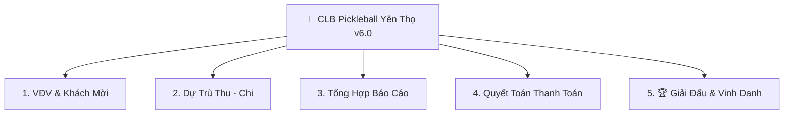

# Tài Liệu Kỹ Thuật & Tính Năng - CLB Pickleball Yên Thọ Pro v6.0

> **File ứng dụng:** [`PicklebalYenTho.html`](file:///d:/MrTiger/L%C6%B0%C6%A1ng%20BHXH/QTD_Tools/PicklebalYenTho.html)  
> **Phiên bản:** `v2026.07.31-v6.0`  
> **Định dạng:** Single-File Offline-First PWA (HTML/JS/CSS hội tụ trong 1 tệp duy nhất)

---

## ❓ 1. Giải Đáp: "Dùng jsonbin.io thì có cần đẩy data lên GitHub không?"

**Trả lời: KHÔNG BẮT BUỘC, NƯNG RẤT NÊN GIỮ CẢ 2 NỀN TẢNG!**

Ứng dụng được thiết kế theo **Kiến Trúc Lưu Trữ 2 Lớp (Dual-Layer Data Architecture)** để đảm bảo an toàn tuyệt đối cho dữ liệu giải đấu:

| Tiêu chí | 🔄 jsonbin.io (Realtime Cloud) | ☁️ GitHub Backup (Long-term Storage) |
| :--- | :--- | :--- |
| **Mục đích chính** | Đồng bộ dữ liệu tức thì giữa các thiết bị đang mở app | Sao lưu dài hạn & Khôi phục khi có sự cố lớn |
| **Tần suất** | Tự động push (2.5s) & pull (8s) liên tục | Thực hiện khi người dùng ấn nút "Lưu & Push GitHub" |
| **Điểm mạnh** | Nhập tỷ số/VĐV trên máy này, máy khác tự cập nhật ngay | Dữ liệu lưu vĩnh viễn trên kho Git dưới dạng file `.json` |
| **Trường hợp sử dụng** | Trong lúc diễn ra giải đấu (nhiều trọng tài/BTC cùng nhập) | Kết thúc ngày thi đấu hoặc lưu trữ lưu vết hàng năm |

👉 **Kết luận:** **jsonbin.io** đóng vai trò là "Cầu nối thời gian thực" giữa điện thoại và máy tính, còn **GitHub Backup** đóng vai trò là "Két sắt an toàn dài hạn". Việc kết hợp cả 2 giúp bạn vừa có trải nghiệm realtime vừa không lo mất dữ liệu!

---

## 🚀 2. Kiến Trúc Công Nghệ (Technology Stack)

Ứng dụng được xây dựng theo chuẩn **Modern Web Application** hiện đại nhất mà không cần cài đặt Node.js hay Build Tools phức tạp:

### 💻 Core Frontend Framework
- **React 18 & ReactDOM**: Quản lý State tập trung (`App` Component) theo tư duy Reactive.
- **Babel Standalone (`@babel/standalone`)**: Biên dịch cú pháp JSX trực tiếp trên Browser theo thời gian thực.
- **Pure JavaScript (ES6+)**: Xử lý logic tính toán Thu-Chi, lọc danh sách, mã hóa dữ liệu.

### 🎨 Giao Diện & Design System
- **Tailwind CSS Engine**: Thiết kế giao diện Glassmorphism với 2 chế độ **Dark Mode / Light Mode** linh hoạt.
- **Google Fonts**: Font chữ `Be Vietnam Pro` cho giao diện Web mượt mà, và `Times New Roman` cho bản in PDF chuẩn văn bản hành chính.
- **FontAwesome 6 Pro**: Hệ thống icon biểu tượng thể thao, tài chính và điều hướng.

### 📊 Xử Lý Dữ Liệu & Xuất Báo Cáo
- **SheetJS (`xlsx@0.18.5`)**: Xuất báo cáo Excel thực tế cho danh sách VĐV, Thu-Chi, Quyết toán và Lịch thi đấu.
- **LocalStorage API**: Lưu trữ dữ liệu an toàn ngay tại thiết bị người dùng (Key: `budgetApp_pickleball_v4`).

### ☁️ Cloud Services & Sync Engine
- **jsonbin.io v3 REST API**: Đóng vai trò Cloud Realtime Database qua `X-Master-Key` & `Bin ID`.
- **GitHub REST API v3**: Tự động tạo Commit và Push file `pickleball_data_backup.json` lên Repository `qtdyentho/qtdyentho_tools`.
- **PWA Service Worker & Cache-Buster**: Tự động dọn dẹp Cache trình duyệt khi có phiên bản mới.

---

## 📋 3. Chi Tiết 5 Phân Hệ Tính Năng Chính

Ứng dụng chia làm 5 Tab chức năng chuyên biệt:

### 1. 👥 Phân hệ 1: Quản Lý VĐV & Khách Mời
- **Đăng ký đa dạng**: Hỗ trợ VĐV nội bộ `CLB Yên Thọ` và Khách mời các đơn vị (`Tam Đa`, `Quý Lộc`, `Công an xã`...).
- **Đăng ký nội dung**: Phân loại Đôi Nam, Đôi Nam Nữ, và đăng ký tiệc Gala Dinner.
- **Tự động liên kết**: Tự động tính toán số lượng VĐV CLB đóng lệ phí và số lượng mâm tiệc Gala.
- **Giao diện Responsive**: Thẻ VĐV thông minh trên Mobile & Bảng quản lý chi tiết trên Desktop.

### 2. 💰 Phân hệ 2: Dự Trù Thu - Chi Kinh Phí
- **Danh mục Thu**: Lệ phí VĐV CLB, Tài trợ Quỹ TDND Yên Thọ & Các mạnh thường quân.
- **Danh mục Chi**: 
  - *Công tác tổ chức*: Băng rôn, bóng thi đấu, nước uống, trái cây, dự phòng...
  - *Giải thưởng*: Cúp vô địch, Cờ giải, Tiền thưởng Nhất / Nhì / Ba.
  - *Gala Dinner*: Mâm cỗ tiệc VĐV CLB, Mâm cỗ khách mời, Đồ uống.
- **Mở khóa chỉnh sửa**: Cho phép người dùng **tự do chỉnh sửa SL/Mâm & Đơn giá** linh hoạt cho toàn bộ các mục.

### 3. 📊 Phân hệ 3: Tổng Hợp Báo Cáo
- **Metrics tổng quan**: Tổng số VĐV (Nam/Nữ), Số cặp đấu Đôi Nam, Số cặp Đôi Nam Nữ, Số mâm tiệc Gala.
- **Cân đối Thu - Chi**: Hiển thị tổng thu, tổng chi và số dư quỹ giải đấu.
- **Xuất Excel**: Xuất file Excel báo cáo tài chính chỉ với 1 cú nhấp chuột.

### 4. 📝 Phân hệ 4: Quyết Toán Thanh Toán
- **Theo dõi theo người chi**: Ghi nhận rõ cá nhân/đơn vị đứng ra tạm ứng chi trả (BTC, Ban Hậu Cần, Anh Đức Anh...).
- **Trạng thái tất toán**: Theo dõi khoản nào `Đã Thanh Toán`, khoản nào `Chưa Thanh Toán` để hoàn tiền minh bạch.

### 5. 🏆 Phân hệ 5: Giải Đấu & Vinh Danh
- **Quản lý trận đấu**: Tạo lịch thi đấu cho Đôi Nam và Đôi Nam Nữ (Vòng bảng, Bán kết, Chung kết).
- **Tỷ số Realtime**: Cập nhật tỷ số trực tiếp, tự động xác định cặp đôi chiến thắng.
- **Bảng Vinh Danh**: Ghi nhận và lưu danh nhà Vô địch, Á quân, Đồng giải Ba.

---

## 🌟 4. Các Tính Năng Đột Phá Trên Bản Pro v6.0

### 🖨️ Mẫu In PDF & Báo Cáo Chuyên Nghiệp
- **Watermark chìm**: Chữ mờ `CLB PICKLEBALL YÊN THỌ` in nghiêng 35° chính giữa trang khi in PDF.
- **Số trang tự động**: Hiển thị `Trang X / Y` ở cuối trang theo chuẩn văn bản hành chính.
- **In thông minh theo Tab**: Khi bấm In (`Ctrl + P`), hệ thống chỉ in đúng nội dung tab đang chọn.

### 📱 Trải Nghiệm Mobile Native UX
- **Vuốt chuyển Tab (Swipe Gestures)**: Vuốt trái/phải trên màn hình cảm ứng điện thoại để chuyển mượt qua lại giữa 5 tab.
- **Bottom Sheet Modal**: Form thêm VĐV trượt mượt từ đáy màn hình lên theo chuẩn app di động cao cấp.
- **Badge số lượng**: Hiển thị badge số lượng VĐV CLB Yên Thọ trực quan trên thanh điều hướng bottom bar.
- **Toast Notifications**: Bong bóng thông báo nổi ở đầu màn hình khi lưu dữ liệu hoặc đồng bộ.

### 🔄 Đồng Bộ Realtime (jsonbin.io) & Chia Sẻ Link
- **Nạp sẵn API Key**: Đã nạp sẵn Master API Key miễn phí (`$2a$10$WtqjabafsDUJPehAE2zFm.m7l42WhYUgYLBSfx3gLyX6Qmv1Pf7c.`).
- **Tạo Bin 1-Click**: Bấm `Tạo Bin Mới & Kích Hoạt` là hệ thống tự khởi tạo kho dữ liệu Cloud.
- **Chia sẻ đường link `?bin=ID`**: Nhấn `Copy Link` gửi qua Zalo, người nhận chỉ cần nhấp vào link là điện thoại của họ tự động kết nối và đồng bộ dữ liệu song song!

---

## 🛠️ 5. Hướng Dẫn Vận Hành & Khôi Phục Dữ Liệu

1. **Khai thác tính năng đồng bộ khi giải đấu diễn ra:**
   - Người điều hành mở app ➔ Bấm **`📡 Đồng bộ`** ➔ Bấm **`Tạo Bin Mới & Kích Hoạt`**.
   - Bấm **`Copy Link`** và gửi vào nhóm Zalo CLB.
   - Các trọng tài/thành viên mở link trên điện thoại sẽ tự động nhận dữ liệu và cùng cập nhật tỷ số realtime.
2. **Sao lưu an toàn kết thúc ngày:**
   - Bấm **`Lưu & Push GitHub`** để đẩy 1 bản sao lưu `.json` lưu trữ vĩnh viễn trên kho GitHub.
3. **Phục hồi khi đổi máy mới:**
   - Chọn file `.json` sao lưu ➔ Nhấn nút **Upload (Tải lên)** trên header để nạp lại toàn bộ dữ liệu.
