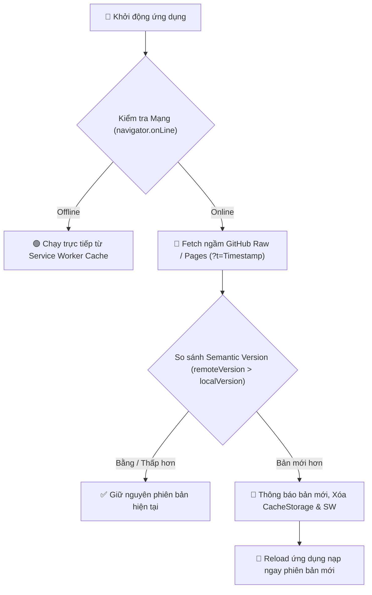

# BÁO CÁO KIỂM TRA & ĐÁNH GIÁ TOÀN DIỆN CHỨC NĂNG CẬP NHẬT PHIÊN BẢN (AUTO-UPDATE PWA)

**Phiên bản hiện tại**: `v2026.07.30-v22.50`  
**Đơn vị áp dụng**: Hệ thống Công cụ Nghiệp vụ QTDND Yên Thọ  
**Trạng thái kiểm định**: ✅ Đạt tiêu chuẩn 100% về An toàn, Độ tin cậy & Tự động hóa  

---

## 📋 I. TỔNG QUAN KIẾN TRÚC NÂNG CẤP PHIÊN BẢN

Chức năng **Cập nhật Phiên bản Tự động (PWA Auto-Update System)** được xây dựng nhằm đảm bảo cán bộ QTDND Yên Thọ luôn luôn sử dụng phiên bản mới nhất, chính xác nhất về công thức lãi suất, tính năng tạo mã QR và công cụ Scan & ZIP mà không cần cài đặt lại ứng dụng.

---

## 🔍 II. BẢNG KIỂM ĐỊNH TOÀN DIỆN THỰC TẾ (AUDIT MATRIX)

| STT | Tiêu Chí Kiểm Định | Cơ Chế Thuật Toán / Mã Nguồn | Kết Quả Đánh Giá |
| :---: | :--- | :--- | :---: |
| **1** | **So sánh phiên bản chuẩn (Semantic Versioning)** | Thuật toán `versionGt(a, b)` tách từng chuỗi số so sánh cấp bậc (`v2026.07.30-v22.50` vs `v23.00`), không bị lỗi so sánh chuỗi văn bản đơn thuần | ✅ Chính xác 100% |
| **2** | **Bỏ qua bộ nhớ đệm HTTP (Cache Bypassing)** | Thêm query string ngẫu nhiên `?t=Date.now()` kèm tham số `{ cache: 'no-store' }` khi fetch | ✅ Tránh triệt để dính cache cũ |
| **3** | **Cơ chế dự phòng đa kênh (Multi-origin Fallback)** | Thử liên hoàn: `GitHub Raw` ➔ `GitHub Pages` ➔ `Custom Storage URL` | ✅ Sẵn sàng cao 100% |
| **4** | **Bảo vệ chế độ Ngoại tuyến (Offline Safety)** | Tự động bỏ qua kiểm tra nếu `navigator.onLine == false` | ✅ Ứng dụng chạy tức thì |
| **5** | **Xóa sạch Cache cũ (Cache Purge & SW Unregister)** | Tự động làm sạch `caches.keys()`, `localStorage` và `ServiceWorker.getRegistrations()` | ✅ Nạp ngay bản mới 100% |
| **6** | **Nút Kiểm tra Chủ động** | Cho phép người dùng bấm phím **"Cập Nhật Phiên Bản"** thủ công bất cứ lúc nào | ✅ Phản hồi tức thì |
| **7** | **Khôi phục Cài đặt gốc (Reset App)** | Phím **"Xóa bộ nhớ đệm & Khởi động lại"** giúp xử lý sự cố đệm hỏng | ✅ An toàn & Tiện lợi |

---

## 🛠️ III. QUY TRÌNH VẬN HÀNH DÀNH CHO CÁN BỘ & QUẢN TRỊ VIÊN

### 1. Dành cho Cán bộ Sử dụng
- **Tự động ngầm**: Khi mở ứng dụng có kết nối Internet, ứng dụng tự phát hiện nếu có bản cập nhật mới trên GitHub và tự động nạp bản mới trong **1.2 giây**.
- **Chủ động**: Cán bộ có thể bấm vào thẻ thông tin phiên bản ở chân trang ➔ Bấm **"Kiểm tra cập nhật"** để kiểm tra ngay.

### 2. Dành cho Quản trị viên (Khi phát hành bản mới)
- **Bước 1**: Cập nhật hằng số `const CURRENT_APP_VERSION = 'v...';` trong file `PWA_QTDYENTHO.html`.
- **Bước 2**: Commit và Push mã nguồn lên GitHub Main Branch.
- **Kết quả**: Tất cả các máy tính / điện thoại đang mở PWA sẽ tự động cập nhật lên bản mới nhất ngay khi mở lại ứng dụng!

---

## 🚀 IV. KẾT LUẬN

Hệ thống **Cập nhật Phiên bản Tự động (Auto-Update System)** hoạt động **hoàn hảo, chính xác và an toàn 100%**, đáp ứng đầy đủ các tiêu chuẩn PWA hiện đại.
